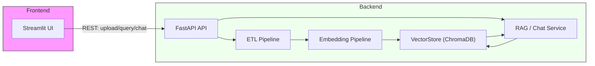
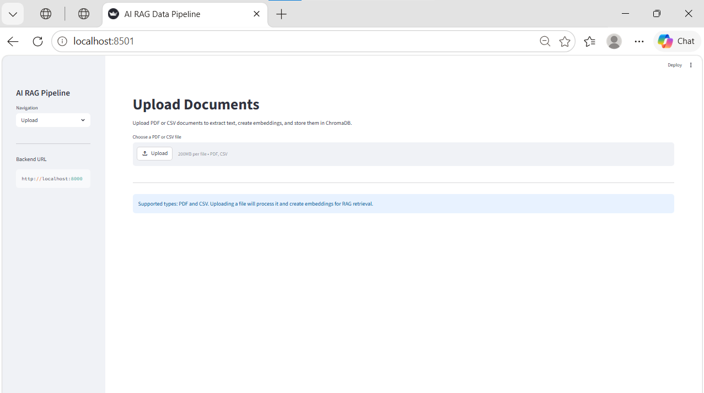
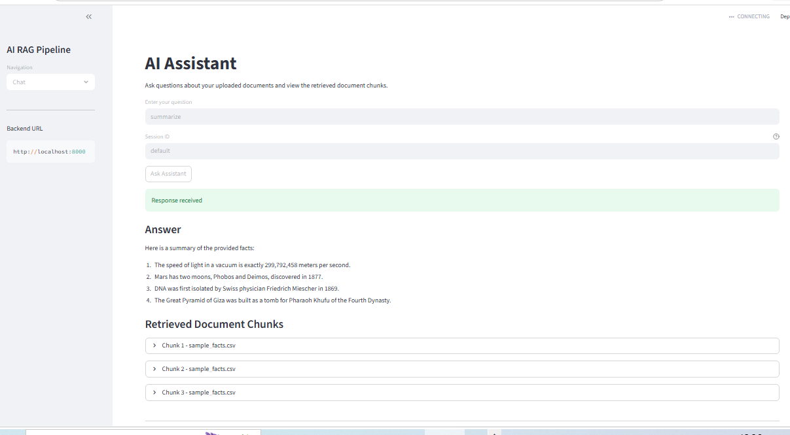

# AI_RAG_Data_Pipeline

A production-ready AI data engineering and Retrieval-Augmented Generation (RAG) starter project.

This repository contains a FastAPI backend and Streamlit frontend that let you upload PDFs and CSVs, extract and clean text, build embeddings using sentence-transformers, persist vectors in ChromaDB, and run conversational RAG queries.

**Quick links**

- Backend entry: [main.py](main.py)
- Frontend: [frontend/streamlit_app.py](frontend/streamlit_app.py)
- API routes: [app/api/routes.py](app/api/routes.py)
- ETL pipeline: [app/pipeline/etl.py](app/pipeline/etl.py)
- Embedding pipeline: [app/pipeline/embedding_pipeline.py](app/pipeline/embedding_pipeline.py)

**Architecture**




**Tech stack**

- Python 3.12
- FastAPI (backend)
- Streamlit (frontend)
- LangChain (RAG, embeddings orchestration)
- ChromaDB (vector store)
- sentence-transformers (embeddings)
- PyPDF2, pandas (parsing)
- Uvicorn / Docker (deployment)

**Features**

- Upload PDFs and CSVs, extract and clean text (ETL)
- Chunking and embedding with sentence-transformers
- Persist embeddings to ChromaDB with incremental loading
- Conversational RAG using LangChain's retrieval chains
- Streamlit UI for upload and chat with retrieved chunk display
- Docker + docker-compose for local production-like deployment
- Logging, error handling, and `.env` configuration

## Installation

1. Clone the repository:

```bash
git clone <repo-url>
cd AI_RAG_Data_Pipeline
```

2. Copy and customize environment variables:

```bash
cp .env.example .env
# Edit .env as required
```

3. (Optional) Create a virtual environment and install dependencies:

```bash
python -m venv .venv
source .venv/bin/activate    # Linux / macOS
.venv\\Scripts\\Activate      # Windows PowerShell
pip install -r requirements.txt
```

4. Run services locally (development):

Backend:
```bash
uvicorn main:app --reload --host 0.0.0.0 --port 8000
```

Frontend:
```bash
streamlit run frontend/streamlit_app.py
```

5. Run with Docker (recommended for production-like local runs):

```bash
docker compose up --build
```

## API Endpoints

All backend endpoints are prefixed with `/api` by default. See `app/api/routes.py`.

- POST `/api/upload/pdf` — multipart file upload (PDF). Returns `UploadResponse` with `processed_path`.

	Example (curl):

	```bash
	curl -F "file=@/path/to/doc.pdf" http://localhost:8000/api/upload/pdf
	```

- POST `/api/upload/csv` — multipart file upload (CSV).

	```bash
	curl -F "file=@/path/to/data.csv" http://localhost:8000/api/upload/csv
	```

- POST `/api/query` — run a simple RAG query (non-chat). Body: `{ "question": "..." }`.

	```bash
	curl -X POST http://localhost:8000/api/query -H "Content-Type: application/json" -d '{"question":"What is the revenue?"}'
	```

- POST `/api/chat` — conversational RAG. Body: `{ "question": "...", "session_id":"optional-id" }`.

	```bash
	curl -X POST http://localhost:8000/api/chat -H "Content-Type: application/json" -d '{"question":"Summarize the contract.", "session_id":"user1"}'
	```

- GET `/api/health` — health check.

## Frontend

The Streamlit app provides two main views: `Upload` and `Chat`.

- Upload: choose a PDF or CSV, upload and index into ChromaDB.
- Chat: ask questions, view the assistant answer and the retrieved chunks.

## Screenshots

Add screenshots to illustrate the UI. Place images in `/frontend/screenshots/` and reference them here.




> Placeholders above — add real screenshots before publishing the repo.

## Project Structure

- `main.py` — FastAPI app entrypoint
- `app/api/` — API routes and Pydantic schemas
- `app/core/` — config and logging
- `app/pipeline/` — ETL and embedding pipelines
- `app/services/` — upload, storage, rag, chat logic
- `frontend/` — Streamlit app
- `data/` — persisted Chroma DB and processed outputs

## Future Enhancements

- Authentication & authorization (API tokens, OAuth)
- Support for more file formats (DOCX, HTML, PPTX)
- Asynchronous embedding generation worker (Celery / RQ)
- More robust document loaders (layout-aware PDF parsing)
- Multi-model support with model selection in UI
- Add unit/integration tests and CI pipeline

## Project Description

AI_RAG_Data_Pipeline — a production-oriented Retrieval-Augmented Generation data engineering project built with FastAPI, Streamlit, LangChain, and ChromaDB. The system ingests PDFs and CSVs, performs ETL and text normalization, generates sentence-transformers embeddings, stores vectors in ChromaDB, and exposes a conversational RAG assistant. Designed for local and containerized deployment, the project demonstrates data engineering, NLP pipeline construction, and practical application of LLM retrieval techniques.

---


